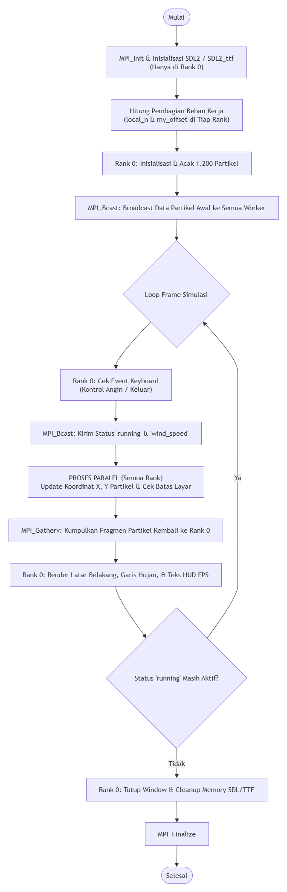
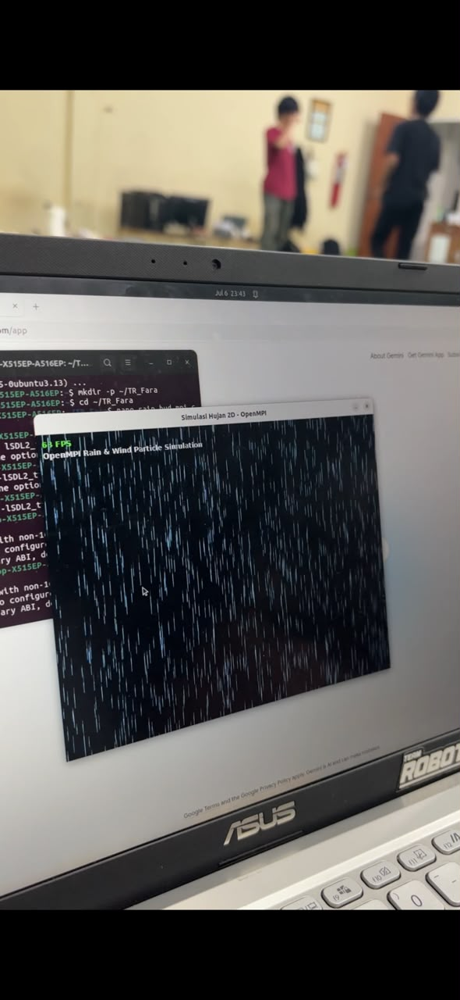

# TR_PEMPAR_FARA
Tugas Rancang Matakuliah Pemprosesan Paralel (CE602) - Simulasi Hujan &amp; Angin 2D Real-Time menggunakan OpenMPI dan SDL2

## 1. Identitas Praktikan
* **Nama:** [Faradila Octavia Nabila]
* **NIM:** [622023016]
* **Mata Kuliah:** Praktikum Pemrosesan Paralel (CE602)

---

## 2. Setup Development Environment
Simulasi ini dikembangkan dan diuji pada sistem operasi **Ubuntu Linux** menggunakan bahasa pemrogramman C++ dengan library **OpenMPI** untuk pemrosesan paralel dan **SDL2 / SDL2_ttf** untuk visualisasi grafis berbasis window .

### A. Pemasangan Dependensi
Jalankan perintah berikut pada terminal Ubuntu untuk memasang kompilator C++, OpenMPI, library SDL2, serta font sistem:
```bash
sudo apt update
sudo apt install -y build-essential g++ openmpi-bin libopenmpi-dev libsdl2-dev libsdl2-ttf-dev fonts-dejavu-core
```

### B. Langkah Kompilasi
Kompilasi program menggunakan wrapper mpic++ dengan menambahkan flag library SDL2 dan SDL2_ttf
```bash
mpic++ -O2 src/rain_hud_mpi.cpp -o bin/rain_simulation -lSDL2 -lSDL2_ttf
```

##  3. Penjelasan Cara Kerja Program
Program yang saya buat melakukan render simulasi jatuh bebas dari 1.200 partikel air hujan pada layar grafis berukuran 800x600 piksel secara real-time.
* **Aturan Perilaku Partikel** : Setiap partikel tetesan hujan memiliki koordinat posisi (```x, y```), kecepatan jatuh vertikal (```speed_y```), dan panjang tetesan (```length```). Koordinat y mengatur pertambahan partikel sesuai dengan kecepatannya. Jika posisi partikel melewati batas bawah layar (```y > 600```), maka posisi akan kembali ke atas layar (```y < 0```) dengan koordinat x yang diacak kembali untuk menciptakan efek hujan yang kontinu dan alami.
* **Fitur Kompleksitas Tambahan (Interaksi Angin)** : Fitur fisika interaktif yang ditambahkan berupa dorongan angin secara horizontal (```wind_speed```) yang akan memiringkan arah jatuh air hujan dan dapat dikontrol oleh user.
* **Heads-Up Display (HUD)** : Menampilkan judul simulasi serta perhitungan FPS (Frames Per Second) secara dinamis yang memiliki 3 warna dan dapat berubah otomatis sesuai kondisinya, yaitu Hijau jika >= 30 FPS, Oranye jika 15-29 FPS, dan Merah jika < 15 FPS, hal ini berguna untuk memantau performa simulasi secara _real-time_.

 ## 4. Flowchart Program


## 5. Penjelasan Implementasi Paralel (OpenMPI)
Antarmuka grafis SDL2 hanya dapat diakses dengan aman melalui satu proses utama pada window system, arsitektur paralel program ini menggunakan pola **Master-Worker** dengan pemprosesan pada bagian utama simulasi :
* **Pembagian Beban Kerja (Workload Distribution)** : Partikel yang digunakan berjumlah 1.200 (_N_) dibagi secara merata kepada jumlah proses (_P_) yang berjalan. Sehingga setiap proses, termasuk Master bertanggungjawab untuk mengkomputasi fisika untuk sekitar _N/P_ partikel. Jika terdapat sisa bagi (remainder), sisa partikel akan didistribusikan ke proses-proses awal sehingga beban komputasi sangat seimbang.
* **Sinkronisasi Instruksi (```MPI_Bcast```)** : Bagian awal setiap frame, Rank 0 (Master) akan mem-broadcast status aplikasi (running) dan parameter interaktif (```wind_speed```) ke seluruh proses Worker agar perhitungan berjalan serempak.
* **Komputasi Paralel Independen** : Kalkulasi untuk perubahan posisi ```x``` dan ```y```, penambahan gaya dorongan angin, serta reset batas layar dilakukan secara paralel oleh masing-masing proses pada memori lokal tanpa _race condition_.
* **Pengumpulan Data (```MPI_Gatherv```)** : Setelah posisi partikel diperbarui, seluruh fragmen array partikel dikumpulkan kembali dari semua Worker ke memori Rank 0 dengan menggunakan fungsi ```MPI_Gatherv``` untuk digabungkan.
* **Rendering Visual** : Setelah data tersinkronisasi di Rank 0, proses Master menggambar visualisasi garis hujan dan teks HUD ke layar.

## 6. Hasil Pengujian Program
Program diuji dengan menggunakan** 4 Core Prosesor Paralel** ```(-np 4)``` pada Ubuntu. Hasil Pengujian menunjukkan simulasi berjalan sangat stabil tanpa error, mampu merender 1.200 partikel secara mulus pada kecepatan optimal **~63 FPS (Real-Time)** dengan indikator FPS berwarna **Hijau**.


<video src="video_hasil.mp4" width="100%" controls></video>


## 7. Dokumentasi Penggunaan Program
Untuk menjalankan program yang telah dikompilasi sebelumnya, digunakan perintah ```mpirun``` dengan menentukan jumlah core prosesor yang diinginkan, pada pengujian ini saya menggunakan 4 Core, 
```bash
mpirun -np 4 ./bin/rain_simulation
```
### Kontrol Interaktif Keyboard
Saat window simulasi aktif, user dapat berinteraksi menggunakan tombol keyboard dengan langsung, berikut penjelasannya :
* **Tombol Panah Kanan** : Menambahkan hembusan angin ke kanan (tetesan hujan akan miring ke kanan)
* **Tombol Panah Kiri** : Menambahkan hembusan angin ke kiri (tetesan hujan akan miring ke kiri)
* **Tombol Panah Bawah** : Mereset kecepatan angin kembali normal (jatuh tegak lurus ke bawah)
* **Tombol ESC / Close Window** : Menghentikan loop simulasi dan menutup program dengan aman
